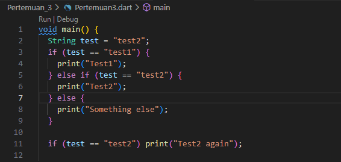
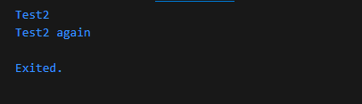
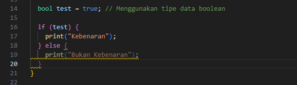
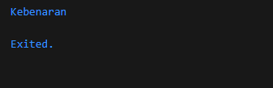
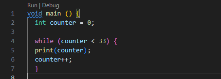
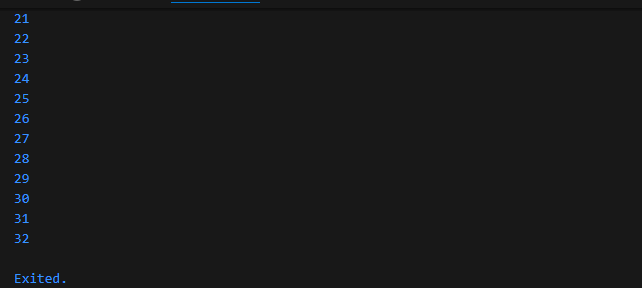
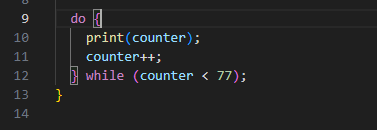
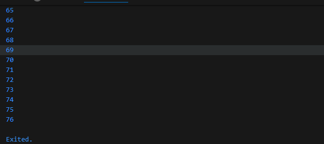

NAMA  : ANDREAS GALE DWI JAYA

KELAS : SIB - 3D

NIM   : 2241760033

**LAPORAN PERTEMUAN 3**

**Praktikum 1: Menerapkan Control Flows ("if/else")**

Langkah 1

Langkah 2 : Silakan coba eksekusi (Run) kode pada langkah 1 tersebut. Apa yang terjadi? Jelaskan!

Output :

Penjelasan : Ketika kode Dart dijalankan, variabel `test` yang diinisialisasi dengan nilai `"test2"` pertama kali diperiksa dalam blok `if-else`. Karena kondisi pertama `if (test == "test1")` tidak terpenuhi, program melanjutkan ke kondisi kedua `else if (test == "test2")`, yang benar, sehingga mencetak `"Test2"`. Setelah itu, ada pemeriksaan kedua dengan kondisi `if (test == "test2")` yang juga benar, sehingga program mencetak `"Test2 again"`. Akhirnya, output yang dihasilkan adalah dua baris: `"Test2"` dan `"Test2 again"`.

Langkah 3 : Tambahkan kode program berikut, lalu coba eksekusi (Run) kode Anda.

String test = "true";
if (test) {
   print("Kebenaran");
}

Apa yang terjadi ? Jika terjadi error, silakan perbaiki namun tetap menggunakan if/else.

Output :

Penjelasan :

**Praktikum 2: Menerapkan Perulangan "while" dan "do-while"**

Langkah 1 : Ketik atau salin kode program berikut ke dalam fungsi main().

Langkah 2 : Silakan coba eksekusi (Run) kode pada langkah 1 tersebut. Apa yang terjadi? Jelaskan! Lalu perbaiki jika terjadi error.

Penjelasan : 

Output :

Langkah 3 : Tambahkan kode program berikut, lalu coba eksekusi (Run) kode Anda.

Output :

Apa yang terjadi ? Jika terjadi error, silakan perbaiki namun tetap menggunakan do-while.

Penjelasan :

**Praktikum 3: Menerapkan Perulangan "for" dan "break-continue**

Langkah 1 : Ketik atau salin kode program berikut ke dalam fungsi main().

Langkah 2 : Silakan coba eksekusi (Run) kode pada langkah 1 tersebut. Apa yang terjadi? Jelaskan! Lalu perbaiki jika terjadi error.

Output :

Penjelasan : 
Langkah 3 : Tambahkan kode program berikut di dalam for-loop, lalu coba eksekusi (Run) kode Anda.

If (Index == 21) break;
Else If (index > 1 || index < 7) continue;
print(index);

Apa yang terjadi ? Jika terjadi error, silakan perbaiki namun tetap menggunakan for dan break-continue.

Output :

Penjelasan :