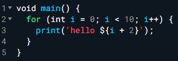
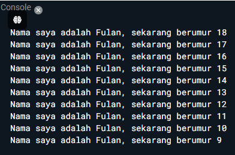
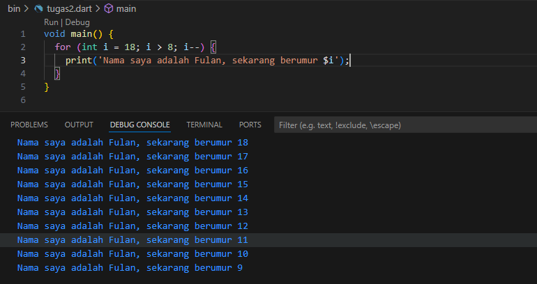

NAMA  : ANDREAS GALE DWI JAYA

KELAS : SIB - 3D

NIM   : 2241760033

**LAPORAN PERTEMUAN 2**

**Soal 1**
Modifikasilah kode pada baris 3 di VS Code atau Editor Code favorit Anda berikut ini agar mendapatkan keluaran (output) sesuai yang diminta!

output yang diminta :

Jawab : 

**Soal 2**
Mengapa sangat penting untuk memahami bahasa pemrograman Dart sebelum kita menggunakan framework Flutter? Jelaskan! 

Jawab : Memahami bahasa pemrograman Dart sebelum menggunakan framework Flutter sangat penting karena Dart adalah fondasi dari Flutter, dan semua kode dalam Flutter ditulis menggunakan bahasa ini. Memahami Dart memungkinkan pengembang untuk menguasai konsep-konsep dasar seperti tipe data, kontrol alur, dan manajemen memori yang esensial dalam pengembangan aplikasi. Selain itu, Flutter menggunakan pendekatan berbasis widget dan manajemen status yang erat kaitannya dengan konsep-konsep Dart seperti async/await, future, dan stream. Tanpa pemahaman yang kuat tentang Dart, pengembang akan kesulitan menulis kode yang efisien, mengatasi bug, serta mengoptimalkan performa aplikasi. Menguasai Dart juga membuka peluang untuk membuat paket dan plugin khusus yang dapat digunakan kembali dalam berbagai proyek Flutter, sehingga memperluas kemampuan dan fleksibilitas pengembang dalam membangun aplikasi berkualitas tinggi.

**Soal 3** Rangkumlah materi dari codelab ini menjadi poin-poin penting yang dapat Anda gunakan untuk membantu proses pengembangan aplikasi mobile menggunakan framework Flutter.

Jawab : 

Dart adalah bahasa pemrograman yang di kembangkan oleh google dan kemudian di setujui sebagai standart oleh ecma, yang saat ini digunakan untuk membangun aplikasi web, server, desktop, dan seluler. 

Dart diluncurkan pada tahun 2011, Dart telah berkembang sejak saat itu. Dart merilis versi stabilnya pada tahun 2013, dengan perubahan besar termasuk dalam rilis Dart 2.0 menjelang akhir 2018

Dart bertujuan untuk menggabungkan kelebihan-kelebihan dari sebagian besar bahasa tingkat tinggi dengan fitur-fitur bahasa pemrograman terkini, antara lain sebagai berikut:

a. Productive tooling: merupakan fitur kakas (tool) untuk menganalisis kode, plugin IDE, dan ekosistem paket yang besar.

b. Garbage collection: untuk mengelola atau menangani dealokasi memori (terutama memori yang ditempati oleh objek yang tidak lagi digunakan).

c. Type annotations (opsional): untuk keamanan dan konsistensi dalam mengontrol semua data dalam aplikasi.

d. Statically typed: Meskipun type annotations bersifat opsional, Dart tetap aman karena menggunakan fitur type-safe dan type inference untuk menganalisis types saat runtime. Fitur ini penting untuk menemukan bug selama kompilasi kode.

e. Portability: bahasa Dart tidak hanya untuk web (yang dapat diterjemahkan ke JavaScript) tetapi juga dapat dikompilasi secara native ke kode Advanced RISC Machines (ARM) dan x86.

Tipe Data pada Dart Dart memiliki beberapa tipe data dasar yang umum digunakan, seperti: 
- int: Representasi bilangan bulat, misalnya 1, 10, -5, dan lain-lain. 
- double: Representasi bilangan desimal atau pecahan, misalnya 3.14, 2.5, -0.75, dan lain-lain. 
- String: Representasi teks atau karakter, misalnya “Hello, Dart!” atau “Welcome”. 
- Bool: Representasi nilai boolean, yaitu true atau false. 
- List: Representasi daftar nilai yang sama atau beragam. 
- Map: Representasi pasangan kunci-nilai. 
- dynamic: Tipe data dinamis yang dapat berubah pada waktu runtime.

Lingkungan yang mendukung bahasa Dart perlu memperhatikan fitur-fitur penting seperti berikut:

- Runtime systems
- Dart core libraries
- Garbage collectors

Eksekusi kode Dart dapat beroperasi dalam dua mode :

- Kompilasi JIT adalah tempat kode sumber dikompilasi sesuai kebutuhan—Just in time. Dart VM memuat dan mengkompilasi kode sumber ke kode mesin asli (native). Pendekatan ini digunakan untuk menjalankan kode pada command line atau selama proses pengembangan aplikasi mobile yang dapat memanfaatkan fitur seperti debugging dan hot reload.
- Kompilasi AOT adalah dimana Dart VM dan kode Anda dikompilasi sebelumnya, VM bekerja lebih seperti sistem runtime Dart, yang menyediakan garbage collector dan metode-metode native dari Dart software development kit (SDK) pada aplikasi. Pendekatan ini memiliki keuntungan performa yang sangat besar dibandingkan kompilasi JIT, tetapi fitur lain seperti debugging dan hot reload tidak tersedia.

